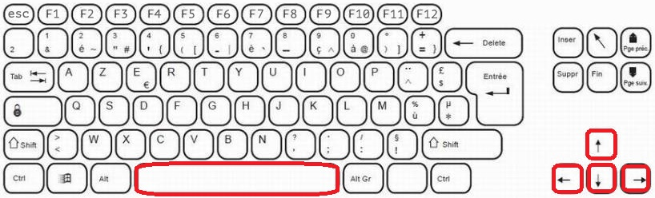
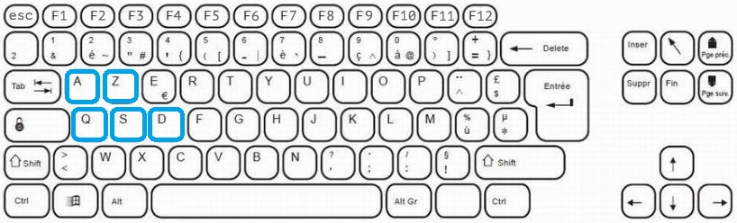
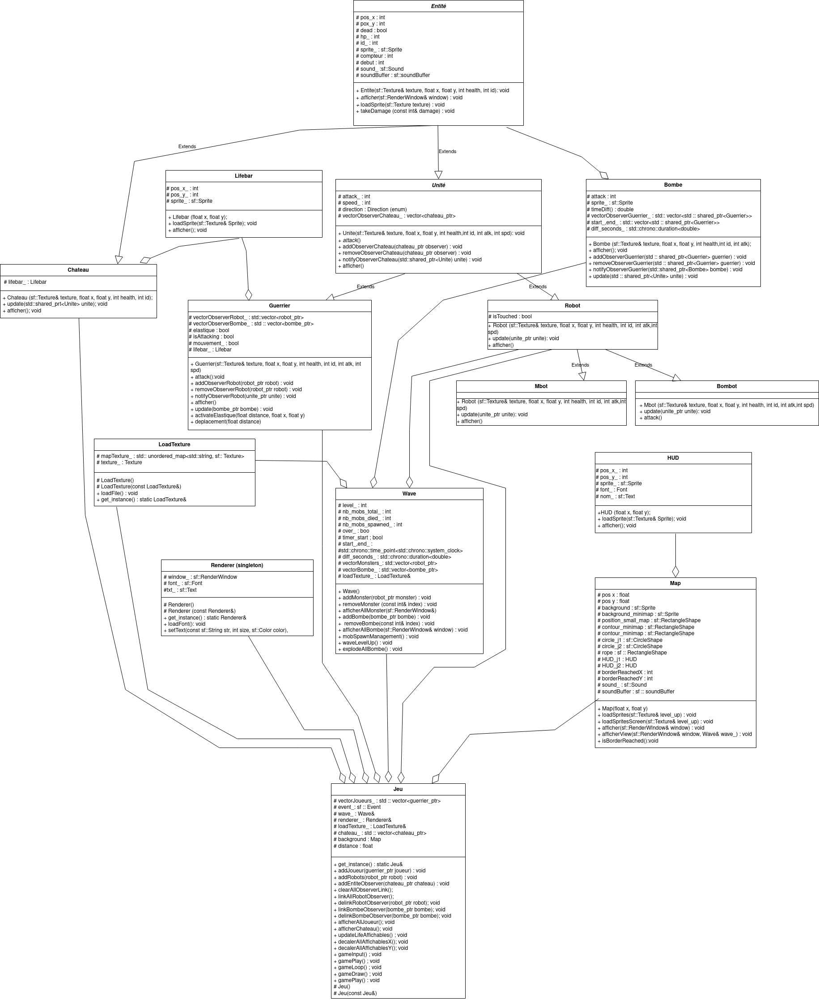

# Rope-Rampart


Code source du jeu Rope Rampart, un jeu de défense d'un château avec 2 personnages liés par une corde !

## Informations sur le projet

### Cadre du projet
Projet réalisé dans le cadre de la fin du module de Programmation orienté objet de Robotique 4 de Polytech Sorbonne.

### Auteurs
* Daniel FU (Github ID : Panxel) - Etudiant en 4e année de Robotique à Polytech Sorbonne.
* Lilian DELORY (Github ID : LilianDelory) - Etudiant en 4e année de Robotique à Polytech Sorbonne.

## Pré-requis

* C++
* SFML

### Installation de SFML

Pour installer la bibliothèque SFML, tapez cette commande sur votre terminal : 

 ```sudo apt install libsfml-dev```


## Compilation et exécution

Une fois que vous avez mis le repository sur votre pc notamment grâce à la commande :

```git clone https://github.com/Panxel/Rope-Rampart.git```

Vous pouvez commencer à jouer au jeu !

* Pour compiler le programme, tapez la commande

```make ```

* Pour lancer le programme, tapez la commande

```./main```

## But du jeu

Le jeu est le suivant :

C'est un jeu à deux joueurs dont le but est de défendre le château des vagues de robots. Le jeu se termine si le château est détruit ou si un des deux joueurs meurt. Bien sûr, pour rendre le jeu plus original et plus difficile, les deux joueurs sont attachés par une corde empêchant de s'éloigner l'un de l'autre.
 
Le jeu se déroule dans une carte 2D vue de dessus avec dans le coin à droite une minimap pour voir l'arrivée des robots.

## Controle du jeu

Chaque joueur se déplace en utilisant 4 touches du clavier :

* Le 1er joueur se contrôle avec les flèches directionnelles et attaque avec la barre d'espace



* Le 2eme joueur se contrôle avec les touches ZQSD et attaque avec la touche A




## Remarque

Une attention particulière a été portée sur la physique du jeu. En effet, l'effet élastique de la corde a été conçu de manière précise afin de rendre le jeu le plus réaliste possible. Nous avons également accordé une importance à une bonne gestion de l'apparition des robots ennemis, conçue de manière à ce que les robots, qu'il s'agisse des "mbots" ou des "bombots", apparaissent de manière totalement aléatoire, offrant ainsi une expérience différente à chaque partie. Cette gestion entraîne également une élévation du niveau du jeu en fonction des différents niveaux passés. Le jeu devient de plus en plus difficile au fil des vagues, avec plus de robots et notamment plus de "Bombots". Enfin, bien que ce ne fût pas l'objectif principal du projet, un soin particulier a été apporté à l'aspect graphique du jeu. Des animations et des sons ont également été ajoutés, ce qui rend l'expérience de jeu plus captivante pour l'utilisateur.

La version finale du jeu présentée pour ce projet diffère de ce que nous avions initialement prévu. Elle a évolué au fil du projet. Certains éléments auxquels nous avions pensé au début du projet, tels que l'amélioration des personnages au fil des niveaux ou l'introduction de personnages aux caractéristiques différentes, ne sont finalement pas présents, mais ils pourraient faire l'objet d'une deuxième version plus complète du jeu. Cependant, des éléments tels que la gestion automatique des robots ennemis, la création de la physique de l'élastique entre les joueurs ou encore la gestion des animations de déplacement, auxquels nous n'étions pas certains de pouvoir les implémenter correctement au début du projet, sont finalement présents avec un rendu plus que convaincant.

Finalement, nous sommes fiers du projet réalisé et nous avons acqueri de nombreuses compétences dans l'utilisation de la programmation orienté objet et l'utilisation de SFML.

### Répartition du travail

Daniel s'est principalement penché sur la physique du jeu et son bon déroulement lors d'une partie. Il s'est notamment occupé de la réalisation des classes principales du jeu, telles que celles des guerriers, des robots et du château. Il a porté son attention sur la bonne interaction de toutes les entités du jeu, en particulier en s'intéressant à la collision entre elles. Enfin, il a pu implémenter l'apparition automatique des robots et leur gestion entre les différents niveaux.

Lilian s'est principalement intéressé à l'aspect graphique du jeu. Il a notamment implémenté les classes nécessaires à une bonne gestion graphique du jeu (Map, Lifebar, HUD, etc.). Il s'est concentré sur la réalisation du ressenti élastique de la corde, le déplacement des joueurs dans une grande carte et a mis en place le radar en haut à droite de la fenêtre de jeu. Enfin, il a réalisé les animations du jeu, telles que la course des joueurs, l'attaque des joueurs, le déplacement de la carte et la course des robots.

Au final, la répartition des tâches a été très homogène et chacun a pu contribuer au projet de manière équilibrée, tout en s'intéressant au travail de l'autre. L'aspect gestion de projet a été primordial et bien mis en place pour la réalisation de ce projet.

## Documentation et Tests

La documentation du code se trouve dans le dossier Documentation.

Les tests réalisés se trouvent dans le dossier test du dossier Game.

## UML des classes


